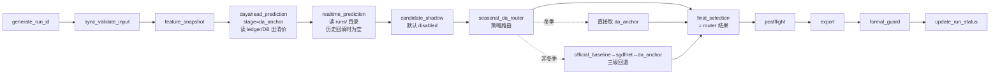
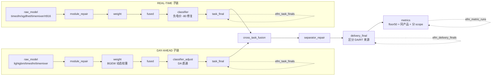

# EFM3 生产电路差距审计（Gap Audit）

> 仓库：`electricity_price_forecast3.0`（本地 `efm3.0`），分支 `agent/production-circuit-gap-audit-db-redesign`
> 配套文档：`EFM25_PRODUCTION_CIRCUIT_REVERSE_ENGINEERING.md`（2.5 事实基线）、`EFM3_PRODUCTION_CIRCUIT_DESIGN.md`（目标设计）
> 日期：2026-07-09
> 结论先行：**3.0 当前"能跑出数字" ≠ "跑出 2.5 语义的生产结果"**。差距为结构性（缺整段电路），非调参层面。

---

## 1. 当前电路（AS-IS，实证于 `full_chain_orchestrator.py` + `seasonal_da_router.py`）

**关键事实（代码实证）：**
- `dayahead_prediction` 仅**读取**已存在的 `da_anchor`（日前出清价），**没有任何模型推理**（第 296–378 行）。
- `seasonal_da_router` 是**策略选择器**，不是融合链：冬季直接取 `da_anchor`，非冬季尝试 `official_baseline`(realtime)→`sgdfnet`→`da_anchor` 回退（第 77–132 行）。
- `final_selected` 的 `pred_price` 100% 等于某单一来源（da_anchor 或回退源），**不是多模型融合产物**（已 SQL 验证：5976/5976 行 pred==da_anchor 值）。
- 无动态权重学习、无融合、无分类器、无修复、无 DA/RT 分离交付、无状态机兜底。
- 指标：当前 49.70% SMAPE = `da_anchor`（日前出清价）vs `rt_actual`（实时实际价）= **跨产品价差**，详见 §4 与 `METRIC_PARITY_AUDIT_REPORT.md`。

---

## 2. 目标电路（TO-BE，基于 2.5 语义 + 新建 `pipelines/production_circuit/`）

**目标电路已在 `pipelines/production_circuit/` 以骨架形式落地**（11 个模块，每步写 `efm_pipeline_steps` + 相应 V2 表）。但在 2.5 模型输出迁移前，dayahead 子链以 `da_anchor` 作 **benchmark 候选**（显式标注 `MISSING_MODEL_OUTPUT`），realtime 子链因无模型输出而 **PARTIAL/SKIPPED**（绝不伪造）。

---

## 3. 差距矩阵（Gap Matrix）

| ID | 2.5 能力 | 3.0 现状 | 严重度 | 是否阻塞生产口径 |
|---|---|---|---|---|
| G1 | 日前/实时**双独立子链**（独立模型集·权重·融合） | 仅单链 `da_anchor → router → final_selected`，**无 RT 子链** | 🔴 BLOCKER | 是 |
| G2 | 动态权重 `w*=exp(-eta·gate·norm_loss)`，`floor=0.03`，`eta=0.8` | 无任何权重学习 | 🔴 BLOCKER | 是 |
| G3 | 融合**重归一化 + 绝不 fillna(0)**，按 `(task,period)` | 无融合环节（router 直接选源） | 🔴 BLOCKER | 是 |
| G4 | **分类器仅实时**：`(final_pred==1)&(y_fused<=100)→-80` | 无分类器 | 🟠 HIGH | 是（RT 极端价修复缺失） |
| G5 | delivery **区分 DA/RT 来源**（RT 用 UNCORRECTED） | `final_selected` 单表，无来源区分 | 🟠 HIGH | 是 |
| G6 | 状态机 `NORMAL/DEGRADED/FAILED` + `historical_same_hour_median` 兜底 | 仅 `_determine_delivery_status` 粗略三态，无历史中位数兜底 | 🟡 MEDIUM | 否（可靠性） |
| G7 | 指标 **`smape_floor50`** + **DA/RT 分别同产品评估** | 无 floor50，跨产品混算（`da_anchor` vs `rt_actual`） | 🔴 BLOCKER | 是（指标不可比） |
| G8 | 周期 `1_8/9_16/17_24` 权重与指标拆分 | 无周期概念 | 🟡 MEDIUM | 否（粒度） |
| G9 | 完整血缘：双子链→delivery，每决策可溯 | `final_selected` 单表无血缘 | 🟠 HIGH | 是（可审计性） |
| G10 | 每步写 ledger 且每模型/每小时可追溯 | 有 `efm_predictions` 但 schema 过平，无 step/lineage/batch 表 | 🟡 MEDIUM | 否（长期维护） |
| G11 | 模型输出 30 天滚动学习（无验证集/无 OOF） | 无模型训练/推理接入点 | 🔴 BLOCKER | 是（无真模型） |
| G12 | `realtime_cutoff_hour` 单一真相（默认 14） | 多处不一致隐患（2.5 部分 config 用 15） | 🟡 MEDIUM | 否（待统一） |

> **汇总**：4 个 BLOCKER（G1/G2/G3/G7/G11 实为 5 个）直接决定"是否为 2.5 语义的生产结果"。本次重构**先搭电路骨架 + DB V2 + smoke 验证节点落库**，不谎报模型精度；真模型迁移是后续独立阶段。

---

## 4. 当前指标警告（CRITICAL METRICS WARNING）

> ⚠️ **禁止将 49.70% 当作 3.0 模型生产精度，亦禁止与 2.5 的 14%/23% 直接比较。**

**实证根因（SQL 已验证）：**
- `efm_predictions` 中 `stage='final_selected'` 的全部 5976 行，`pred_price` 100% 等于 `da_anchor` 值；`task` 全部来自 `da_anchor`（无模型输出行）。
- `actual` 取 `efm_actual_prices.rt_actual`（**实时实际价**）。
- 因此 **49.70% SMAPE = 日前出清价 vs 实时实际价 = 跨产品价差**，而非"模型预测 vs 同产品结算价"。

**对比 2.5 口径：**
| 口径 | 预测 | 实际 | floor50 | 聚合 | 可比性 |
|---|---|---|---|---|---|
| 3.0 当前 | da_anchor（日前出清） | rt_actual（实时实际） | 无 | 按日均值再平均 | ❌ 跨产品 |
| 2.5 14%/23% | 模型融合 | **同产品结算价** | 有（逐点 clip 50） | pooled | ✅ 同产品 |

- 同产品对照：`da_anchor` vs `da_actual` ≈ **9.3%**，证明当前大误差主源是**跨产品价差**，非模型本身。
- 2.5 的 14%/23% 在仓库内**无源码可溯源**，需用 `smape_floor50`（同产品）在 3.0 中复现，不可直接引用。

**本次修复（`tools/db_ops/db_yearly_metrics.py`）：**
- 新增 `--metric-scope {benchmark,dayahead,realtime,delivery}`。
- `benchmark` = `da_anchor` vs `rt_actual`（跨产品，显式标注 **NOT a model metric**）。
- `dayahead`/`realtime` = `efm_task_finals` vs **同产品** actual，**仅当存在真实模型 final 时计算**，否则 `UNCLEAR`/`NEEDS_MODEL_OUTPUT`，**绝不伪造**。
- 默认启用 `floor50`（`--no-floor50` 关闭）；结果写入 `efm_metric_runs` 并带 `result` 标签（`OK`/`UNCLEAR`/`NO_DELIVERY`/`NO_DATA`）。

---

## 5. 本次交付边界（Scope Guardrails）

| 做 ✅ | 不做 ❌ |
|---|---|
| 搭 DB Ledger V2（005，8 张新表，非破坏） | 调优/替换 champion 模型 |
| 建 `production_circuit/` 11 模块骨架，每步落库 | 把 `da_anchor` 伪装成最终模型输出 |
| smoke 验证节点落 `efm_pipeline_steps` 等 | 在在线关键路径放 RT916/TimeMixer |
| 指标语义修复（scope + floor50 + 防伪装） | 生成正式 submission / 选 shadow 进 final |
| 保留 PR #12/#14/#15/#16 既有能力 | 删除既有 DB/API/backfill 能力 |

**下一步（独立阶段）**：迁移 2.5 模型输出到 `efm_predictions` 的 `dayahead_raw_model`/`realtime_raw_model` 阶段 → 启用真实融合/权重/分类器 → 复现 `smape_floor50` 同产品口径对标 14%/23%。
