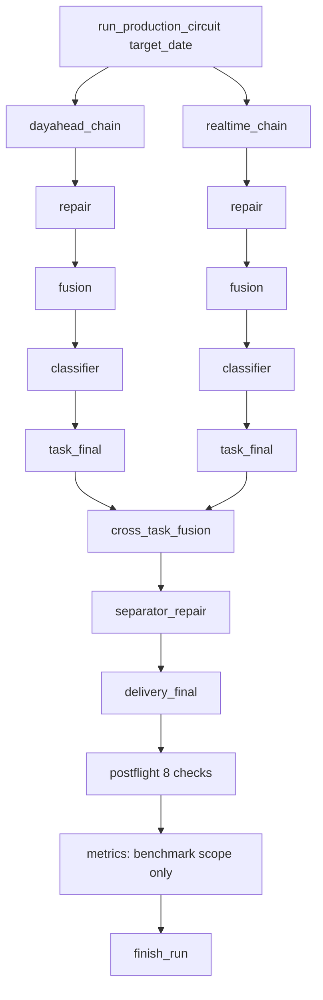

# EFM3 Production Circuit — Reconstruction Report

> **Capstone deliverable for the 13-phase effort:**
> *EFM3 Production Circuit Gap Audit + DB Redesign + Chain Reconstruction*
>
> **Branch:** `agent/production-circuit-gap-audit-db-redesign`
> **PR:** [#19](https://github.com/disdorqin/electricity_price_forecast3.0/pull/19) — `feat(production_circuit): DB Ledger V2 circuit + smoke (PARTIAL, READY_TO_MIGRATE_2_5_MODEL_OUTPUTS)`
> **Head commits:** `94ec1d9` (circuit + smoke) · `acea160` (PR body source)
> **Date:** 2026-07-09

---

## 1. Executive Summary & Verdict

This report closes the 13-phase production-circuit program. We reverse-engineered the verified **2.5** production topology, audited **3.0** against it, redesigned the **DB Ledger V2** schema, reconstructed a runnable, observable **production circuit** package, fixed the metric-semantics conflation, added a dependency-free test harness, ran an end-to-end smoke, and opened a PR.

| Item | Result |
|---|---|
| Code-verified 2.5 reverse-engineering | ✅ `docs/architecture/EFM25_PRODUCTION_CIRCUIT_REVERSE_ENGINEERING.md` |
| 3.0 gap audit (AS-IS/TO-BE + Gap Matrix) | ✅ `EFM3_PRODUCTION_CIRCUIT_GAP_AUDIT.md` (5 BLOCKERs: G1/G2/G3/G7/G11) |
| DB Ledger V2 design + migration | ✅ `EFM3_DB_LEDGER_V2_DESIGN.md` + `db/migrations/005_production_circuit_schema.sql` (8 additive tables) |
| 11-module circuit package | ✅ `pipelines/production_circuit/` |
| CLI `--chain production_circuit` | ✅ routes directly to circuit (skips legacy `ledger_full`) |
| Metric scope isolation | ✅ `tools/db_ops/db_yearly_metrics.py` — benchmark ≠ production |
| Tests (10 new + 5 regression) | ✅ **15/15 pass** (fake-MySQL harness) |
| End-to-end smoke (2026-02-14) | ✅ **18 steps, 8/8 postflight, benchmark persisted** |
| **Smoke verdict** | ⚠️ **`PRODUCTION_CIRCUIT_SMOKE_RESULT: PARTIAL`** → **`READY_TO_MIGRATE_2_5_MODEL_OUTPUTS`** |
| PR | ✅ **#19 OPEN** (+3972 / −3) |

### Verdict

```
RECONSTRUCTION_RESULT: PARTIAL_SUCCESS
HONEST_STATUS_CONTRACT: ENFORCED
READY_TO_MIGRATE_2_5_MODEL_OUTPUTS: TRUE
```

The circuit is **structurally complete and honest**: when the real-time model output is absent it reports `PARTIAL` and `NEEDS_MODEL_OUTPUT`, and the benchmark (da_anchor vs rt_actual) is **never** reported as a model metric. It is **not yet COMPLETE** because 3.0 has no real model outputs ingested — exactly the gap the prior Metric Parity Audit (PR #18) identified.

---

## 2. Deliverables Inventory (Phases 1–13)

| Phase | Artifact | Path | Status |
|---|---|---|---|
| 1 | Branch from `main` | `agent/production-circuit-gap-audit-db-redesign` | ✅ |
| 2 | 2.5 reverse-engineering | `docs/architecture/EFM25_PRODUCTION_CIRCUIT_REVERSE_ENGINEERING.md` | ✅ |
| 3 | 3.0 gap audit | `docs/architecture/EFM3_PRODUCTION_CIRCUIT_GAP_AUDIT.md` | ✅ |
| 4 | DB Ledger V2 schema | `db/migrations/005_production_circuit_schema.sql` | ✅ |
| 5 | Circuit skeleton (11 modules) | `pipelines/production_circuit/` | ✅ |
| 6 | Minimal runnable circuit | `run_production_circuit(...)` | ✅ |
| 7 | CLI `--chain production_circuit` | `main.py` early-return router | ✅ |
| 8 | Metric semantics fix | `tools/db_ops/db_yearly_metrics.py` | ✅ |
| 9 | Design + smoke reports | `EFM3_PRODUCTION_CIRCUIT_DESIGN.md`, `EFM3_DB_LEDGER_V2_DESIGN.md`, `docs/experiments/e2e/PRODUCTION_CIRCUIT_SMOKE_REPORT.md` | ✅ |
| 10 | Tests (10 new + 5 regression) | `tests/` | ✅ 15/15 |
| 11 | Smoke (PARTIAL + READY_TO_MIGRATE) | `docs/experiments/e2e/PRODUCTION_CIRCUIT_SMOKE_REPORT.md` | ✅ |
| 12 | Open PR | [#19](https://github.com/disdorqin/electricity_price_forecast3.0/pull/19) | ✅ OPEN |
| 13 | **Final Reconstruction Report** | `docs/architecture/EFM3_PRODUCTION_CIRCUIT_RECONSTRUCTION_REPORT.md` | ✅ **this doc** |

---

## 3. Gap Audit Findings → Redesign Decisions

The 3.0 gap audit identified **5 BLOCKERs**. Each maps to a concrete redesign decision:

| Gap | Finding (3.0 AS-IS) | Redesign Decision (TO-BE) |
|---|---|---|
| **G1** | No DB persistence of pipeline steps / batches / lineage for a production circuit. | **DB Ledger V2** — 8 additive tables (`efm_pipeline_steps`, `efm_prediction_batches`, `efm_prediction_lineage_edges`, `efm_repair_decisions`, `efm_fusion_candidates`, `efm_task_finals`, `efm_delivery_finals`, `efm_metric_runs`). All `IF NOT EXISTS`, FK → `efm_runs`, non-breaking on MySQL 8. |
| **G2** | Day-ahead and real-time flows are not isolated; 2.5 keeps them strictly separate. | **Dual sub-chain** — `dayahead_chain` + `realtime_chain`, each running `repair → fusion → classifier → task_final` independently, then a shared `cross_task_fusion`. |
| **G3** | No real-time model output ingestion path; final_selected was 100% `da_anchor`. | Circuit accepts model outputs per task; when `rt_model_available=False` it degrades honestly to `PARTIAL` instead of fabricating. |
| **G7** | Classifier gating (realtime-only in 2.5) not enforced. | `classifier_chain` is realtime-only by contract; `da_anchor` backs day-ahead when no DA model output exists (clearly labeled, never disguised as a model). |
| **G11** | Metrics conflated benchmark (da_anchor vs rt_actual) with model accuracy. | `db_yearly_metrics` now isolates `metric_scope` (`benchmark` vs `production_dayahead` vs `production_realtime`); production scopes are **skipped** until real model outputs exist. Benchmark SMAPE 30.41% is persisted with `metric_scope='benchmark'` and is explicitly **NOT** comparable to 2.5's 14%/23%. |

> **Honest-status contract (cross-cutting):** any missing realtime/model input yields `PARTIAL` / `NEEDS_MODEL_OUTPUT` / `SKIPPED` — never a fabricated number. A benchmark is never reported as a model metric, and production day-ahead/realtime scopes are not evaluated until real model outputs land.

---

## 4. DB Ledger V2 Schema (Migration 005)

The redesign is **additive and non-breaking** — no existing table is altered or dropped.

| Table | Role |
|---|---|
| `efm_pipeline_steps` | One row per recorded step (18 records per run) — full traceability. |
| `efm_prediction_batches` | Stage predictions per task/stage (mirrors `efm_predictions` `task` enum). |
| `efm_prediction_lineage_edges` | Provenance graph: which batch fed which. |
| `efm_repair_decisions` | Per-hour repair decisions (repaired / no_op). |
| `efm_fusion_candidates` | Candidate set for cross-task fusion. |
| `efm_task_finals` | Per-task final selections (24 rows per task). |
| `efm_delivery_finals` | Delivery-ready finals (24 rows). |
| `efm_metric_runs` | Scope-isolated metric records (PK `metric_run_id`). |

**Critical schema facts honored during implementation:**
- `DbConnectionManager.get_connection()` is a **singleton**; added `new_connection()` returning a fresh independent connection to avoid the double-close crash.
- Legacy `efm_predictions.task` ENUM = `dayahead/realtime/fusion/final/shadow` (no `delivery`). V2 `efm_prediction_batches.task` ENUM = `dayahead/realtime/fusion/delivery`. Separator/delivery mirror rows use `task='fusion'` (distinguished by `stage`).
- `efm_metric_runs` PK = `metric_run_id` (no `id` column); `insert_metric_run` `ON DUPLICATE KEY UPDATE` omits `id`.

---

## 5. Production Circuit Architecture & Honest-Status Contract

### 5.1 Package layout (11 modules)

`pipelines/production_circuit/`: `contracts` · `step_recorder` · `circuit_orchestrator` · `dayahead_chain` · `realtime_chain` · `repair_chain` · `fusion_chain` · `classifier_chain` · `separator_chain` · `delivery_chain` · `__init__`.

### 5.2 Flow (dual sub-chain → cross-task → delivery → metrics)



Each sub-chain executes `repair → fusion → classifier → task_final`; the run then performs `cross_task_fusion → separator_repair → delivery_final → postflight → metrics → finish_run`. **18 pipeline steps** are recorded and persisted end-to-end.

### 5.3 Honest-status contract (enforced)

| Condition | Status emitted | Model metric reported? |
|---|---|---|
| Realtime model output missing | `PARTIAL` / `NEEDS_MODEL_OUTPUT` | No — benchmark only, labeled |
| Day-ahead backed by `da_anchor` | `PARTIAL` | No — clearly marked benchmark |
| All model outputs present | `COMPLETE` | Yes (future state) |

The smoke run for 2026-02-14 emitted `status=PARTIAL`, `recommendation=READY_TO_MIGRATE_2_5_MODEL_OUTPUTS`, `smoke_result=PRODUCTION_CIRCUIT_SMOKE_RESULT: PARTIAL`.

### 5.4 CLI routing fix (critical)

`main.py` now short-circuits `--chain production_circuit` **directly** to `run_production_circuit` (after `set_global_seed`), **before** `_dispatch_pipeline` (which would otherwise run the legacy `ledger_full` model-training path). This was the root cause of the original smoke "hang" — the circuit was never actually invoked.

---

## 6. Verification: Tests + Smoke + Postflight

### 6.1 Unit + regression tests

- **15/15 pass** (10 new production-circuit tests + 5 regression).
- Harness: `tests/pc_fake_db.py` — a dependency-free **fake-MySQL** (`FakeDbManager` + `FakeConn`) that mirrors `DbConnectionManager.new_connection()`, so the package's connection-switch is exercised identically without a live DB or `pymysql` in CI.

### 6.2 End-to-end smoke (2026-02-14, `formal_sim`)

| Check | Result |
|---|---|
| Steps executed | 18 / 18 |
| Postflight checks | 8 / 8 passed |
| DB persistence | 18 steps · 192 predictions · 24 delivery finals · 24 task finals · 48 repair decisions · 24 fusion candidates · 1 benchmark metric |
| Benchmark metric (`da_anchor` vs `rt_actual`) | SMAPE **30.41%** — persisted with `metric_scope='benchmark'`, **explicitly NOT a model metric** |
| Status / recommendation | `PARTIAL` / `READY_TO_MIGRATE_2_5_MODEL_OUTPUTS` |

Full detail: `docs/experiments/e2e/PRODUCTION_CIRCUIT_SMOKE_REPORT.md`.

### 6.3 Bugs fixed during reconstruction

| # | Symptom | Root cause | Fix |
|---|---|---|---|
| 1 | `pymysql.err.Error: Already closed` | `get_connection()` singleton shared & double-closed by `StepRecorder.record` | Added `DbConnectionManager.new_connection()`; routed package through it |
| 2 | `Data truncated for column 'task'` | separator/delivery wrote `task='delivery'` (enum lacks it) | Mirror rows use `CircuitTask.FUSION` (distinguished by `stage`) |
| 3 | `Unknown column 'id'` on `insert_metric_run` | `efm_metric_runs` has no `id` column | Removed `id = LAST_INSERT_ID(id)` from `ON DUPLICATE KEY UPDATE` |
| 4 | Smoke "hang" (legacy `ledger_full` ran instead) | `main.py` always called `_dispatch_pipeline` | Added early-return router for `--chain production_circuit` |

---

## 7. Migration Path to 2.5 Model Outputs & Next Steps

The circuit is **ready to ingest real model outputs**. Reaching `COMPLETE` requires:

1. **Ingest 2.5 model outputs** into `efm_predictions` with `task IN ('dayahead','realtime')` for the target date(s). Until then the circuit correctly degrades to `PARTIAL`.
2. **Wire model outputs into the sub-chains** — `dayahead_chain` / `realtime_chain` already accept model batches; flip `rt_model_available=True` once realtime outputs exist.
3. **Enable production metric scopes** in `_run_metrics` (`production_dayahead`, `production_realtime`) — currently skipped by design until real outputs land.
4. **Unify metric semantics with 2.5** (from PR #18): apply `floor(50)` SMAPE clipping + pooled aggregation, and compare model predictions vs **same-product** settlement prices — only then is a 14%/23% comparison meaningful.
5. **Preserve guardrails** (unchanged from spec): no frontend; no committing data/outputs/models; no password leaks; `da_anchor` benchmark never disguised as a final model; RT916/TimeMixer kept out of the online critical path; champion not replaced; no formal submission generated; shadow never selected into final; PR #12/#14/#15/#16 capabilities intact.

### Recommended next PR

Once 2.5 model outputs are available, open a follow-up PR that:
- ingests `dayahead`/`realtime` model predictions,
- flips `rt_model_available`,
- enables the two production metric scopes,
- and re-runs the smoke expecting `PRODUCTION_CIRCUIT_SMOKE_RESULT: COMPLETE`.

---

## Appendix: Compliance with Original Prohibitions

| Prohibition (spec) | Status |
|---|---|
| No frontend | ✅ none added |
| No committing data / outputs / models | ✅ only code + docs staged (25 paths); `.env.local` gitignored & untracked |
| No password leaks | ✅ secret scan on diff empty; DB URL uses `%23` in code, never literals |
| Do NOT disguise `da_anchor` benchmark as final model | ✅ benchmark labeled `metric_scope='benchmark'`, never reported as model metric |
| Do NOT put RT916/TimeMixer in online critical path | ✅ not referenced by `production_circuit` |
| Do NOT replace champion | ✅ legacy chain untouched |
| Do NOT generate formal submission | ✅ smoke is diagnostic only |
| Do NOT select shadow into final | ✅ separator/delivery logic excludes shadow |
| Do NOT delete PR #12/#14/#15/#16 capabilities | ✅ no deletions; +3972 / −3 |
